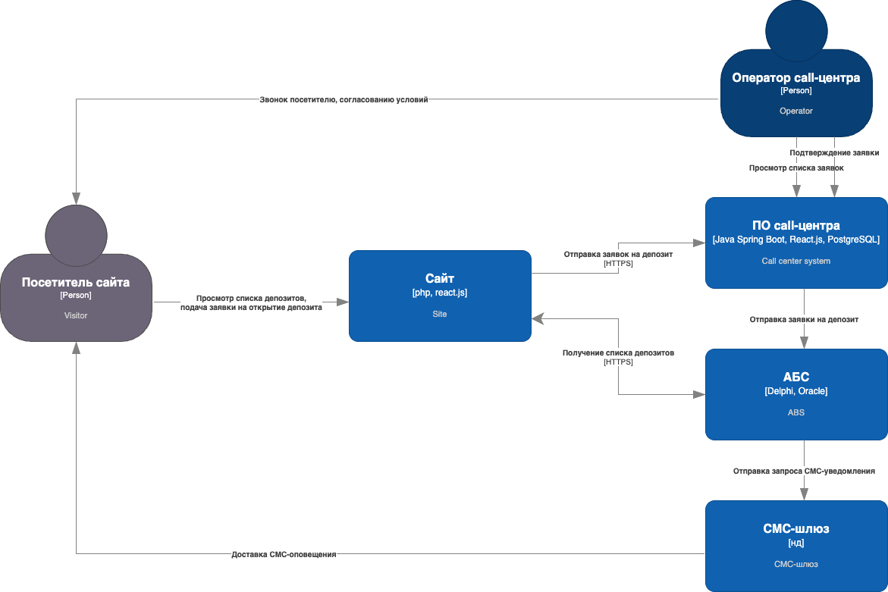
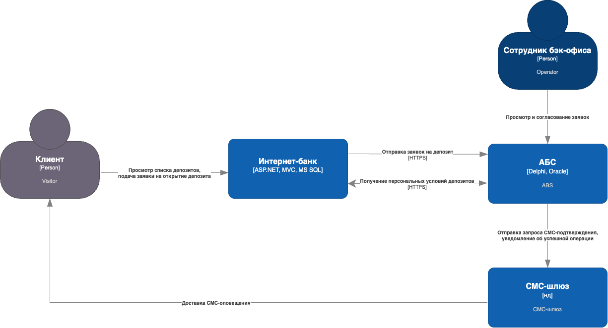
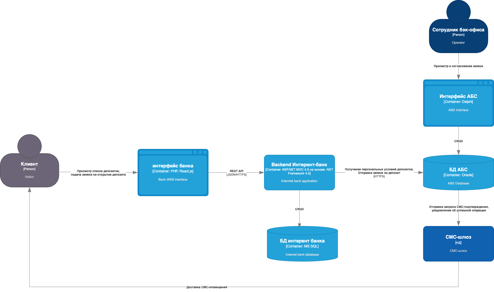

### **Название задачи:открытия депозитов для MVP** 
### **Автор:Александр Пантелеев**
### **Дата:19.04.2025**
### **Функциональные требования**
Опишите здесь верхнеуровневые Use Cases. Их нужно оформить в виде таблицы с пошаговым описанием:

|**№**|**Действующие лица или системы**|**Use Case**|**Описание**|
| :-: | :- | :- | :- |
|UC1| пользователь, сайт, АБС| список доступных депозитов с актуальными ставками| <ol> <li> пользователь заходит на сайт, видит список доступных депозитов с акутальными ставками.</li><li> Сайт запрашивает у АБС актуальные ставки и отображает посетителю.</li> </ol>|
|UC2| Клиент, интернет-банк, АБС| В интернет-банке клиент должен видеть список доступных депозитов с персональными ставками лично для него| <ol> <li> Клиент заходит (авторизуется) в интернет-банк.</li><li> Интернет-банк запрашивает у АБС персональные ставки и отображает клиенту.</li></ol>|
|UC3| Пользователь, сайт, система кол-центра, АБС| Клиент должен иметь возможность подать заявку на депозит, указав телефон и ФИО| <ol> <li> Пользователь выбирает депозит, указывает ФИО и телефон и оставляет заявку на депозит.</li><li> Сотрудник кол-центра перезванивает Пользователю, уточняет условия и оставляет заявку в системе кол-центра.</li><li> Система кол-центра передает заявку на депозит в АБС</li> </ol>|
|UC4| Пользователь, сотрудник бек-офиса, АБС, СМС-шлюз| Для клиента необходимо реализовать СМС-оповещение после согласованиия депозита и ставки | <ol> <li> Сотрудник бэк-офиса согласует заявки на депозиты в АБС.</li><li> АБС инициирует отправку СМС для пользователя о согласовании депозита.</li><li> Пользователь после получения СМС приходит в офис для открытия депозита</li> </ol>|
|UC5| Клиент, интернет-банк, АБС, СМС-шлюз| Клиент может подать заявку на открытие депозита, указав счет и сумму | <ol> <li> Клиент вибирает в интернет-банке персональное предложение об открытии депозита и отправляет заявку на открытие </li><li> АБС принимает заявку, инициирует отправку СМС для клиента о подтверждении операции.</li><li> СМС-шлюз доставлет сообщение с кодом подтверждения операции</li><li> Клиент вводит код подтвержения через интернет-банк</li><li>Интернет-банк передает подтвержение на АБС</li><li>АБС открывает депозит и инициирует отправку СМС об успешной операции через СМС-шлюз</li><li>СМС-шлюз доставляет СМС об успешном открытии депозита</li> </ol>|

### **Нефункциональные требования**
Опишите здесь нефункциональные требования и архитектурно-значимые требования.

|**№**|**Требование**|
| :-: | :- |
|1|Передача данных с сайта должны производиться по защищенному протоколу с шифрованием трафика|
|2|Подтверждения операций должны производиться с помощью СМС-кода|
|3|Протокол общения АБС - интернет-банк должен быть защищен механизмом шифрования|
|4|Все сервисы должны работать 24/7 и быть доступны в 99,9% случаев|
|5|Необходимо предусмотреть резервирование систем банка в другом ЦОД|
|6|Надо предусмотреть равномерное горизонтальное масштабирование и распределение запросов между серверами, приложениями и ЦОД|
|7|Отклик по всем операциям должен быть максимально быстрым и занимать миллисекунды|
|8|Необходимо по-возможности снизить нагрузку на БД|
|9|Банки не должны принимать новых клиентов без личной проверки документов|
|10|Функционал СМС-оповещений требует доработок партнеров, лучше этого избежать|
|11|Ставки по депозитам ведутся только в XLS, с ними работают сотрудники бэк офиса, до перехода на АБС эту процедуру надо сохранить|
|12|Для очередей сообщений необходимо использовать Kafka|
|13|Лучше избежать прямой работы интернет-банка с API АБС в новом процессе|
|14|АБС может масштабироваться только вертикально из-за своей базы данных|

### **Решение**
Приведите диаграммы контекста и контейнеров в модели C4. Опишите там основные компоненты и интеграции всех элементов решения.

#### Диаграмма контекста Сайта

#### Диаграмма контекста интернет-банка

#### Диаграмма контейнеров интернет-банка

В ходе принятия решений и выбора технологий старался максимально сохранить существующий стек, особенно, с учетом MVP и ограничений.

### **Альтернативы**

Альтернативным решением является разработка полноценного middleware (сервера приложений) для АБС, поскольку в настоящий момент логика на Oracle трудна в поддержке и масштабировании.

**Недостатки, ограничения, риски**

Недостатком и ограничением является строго вертикальное масштабирование АБС из-за логики в БД. Так же в случае Oracle банк может попасть под условие импортозамещения. Ограничения так же зафиксированы в разделе Нефункциональные требования.
