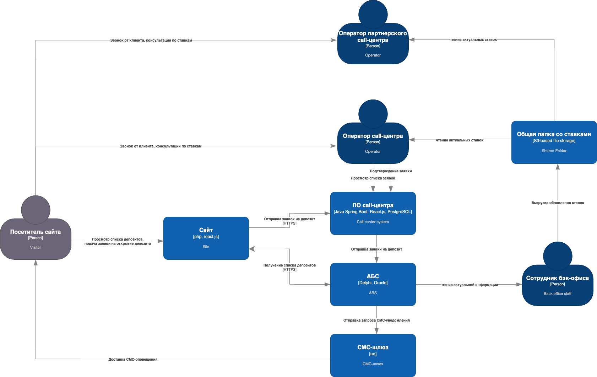
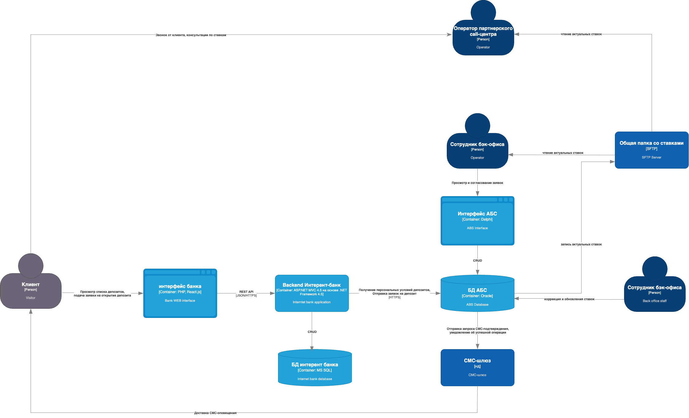

### **Название задачи:Передача ставок в кол-центр** 
### **Автор:Александр Пантелеев**
### **Дата:19.04.2025**
### **Функциональные требования**
Опишите здесь верхнеуровневые Use Cases. Их нужно оформить в виде таблицы с пошаговым описанием:

|**№**|**Действующие лица или системы**|**Use Case**|**Описание**|
| :-: | :- | :- | :- |
|UC1| Клиент, кол-центр (внутренний)| Клиент должен иметь возможность позвонить в кол-центр для консультации по ставкам| <ol> <li> Клиент заходит на сайт, видит список доступных депозитов с акутальными ставками, у него остаются вопросы.</li><li> Клиент звонот в кол-центр, сотрудник кол-центра оказывает консультации.</li> </ol>|
|UC2| Сотрудник бэк-офиса, партнерский кол-центр| Партнерскому кол-центу необходимо регулярно предоставлять информацию по ставкам| <ol> <li> В ходе пересчета ставок сотрудник бэк-офиса загружает файл со ставками в общий файлообменник.</li><li> Партнерский кол-центр регулярно проверяет изменения в данном файле и передает своим сотрудникам для консультаций с клиентами.</li></ol>|
|UC3| Клиент, партнерский кол-центр| Звонки от клментов должны так же обрабатываться партнерским кол-центром с актуальной информацией по ставкам| <ol> <li> Клиент звонит в кол-центр</li><li> При загрузке внутреннего кол-центра звонок обрабатывается партнерским</li><li> Сотрудник партнерского кол-центра с информацией о ставках, переданной в UC2 оказывает консультации</li> </ol>|

### **Нефункциональные требования**
Опишите здесь нефункциональные требования и архитектурно-значимые требования.

|**№**|**Требование**|
| :-: | :- |
|1|Передача данных должна производиться по защищенному протоколу с шифрованием трафика|
|2|Нет возможности сделать API-вызовы в АБС|
|3|Партнерский кол-центр готов получать актуальные ставки в виде файлов|
|4|Все сервисы должны работать 24/7 и быть доступны в 99,9% случаев|

### **Решение**
Приведите диаграммы контекста и контейнеров в модели C4. Опишите там основные компоненты и интеграции всех элементов решения.

#### Диаграмма контекста решения с интеграцией кол-центра

#### Диаграмма контейнеров решения с интеграцией кол-центра

В ходе принятия решений сделал минимальное усложнение решения с учетом ограничений и сохранения ручных операций по обновлению ставок.

### **Альтернативы**

Альтернативным решением является автоматизация доставки обновления ставок на сервера портнеров.

**Недостатки, ограничения, риски**

Недостатком и ограничением является зависимость от ручных операций, потенциальная уязвимость файлового хранилища.